<h1>Self-Sufficient Living</h1>

### Table of Contents
1. [Artefact](#artefact)
    1. [Metadata](#metadata)
    2. [Research on the Artefact](#research-on-artefact)
2. [Global Research](#global-research)
3. [Research Questions](#research-questions)
4. [Transcodings](#transcoding)
    1. [Transcoding No. 1](#transcoding-no-1)
5. [Reflection](#reflection)
6. [Outcome](#outcome)
7. [Bibliography](#bibliography) 

# First Trajectory of the Project
<h3>The Initial Mindmap</h3>

obsessive collecting of objects in space / ordering and labelling of objects > it is a to compensate the mental emptiness and loneliness / solitude > also to isolate the Self and push the autonomy and independence of the Self, as it feels natural, it is a path > it is a patterned way of interaction with the surroundings, a particular strategy of an individual > on one side - independence and autonomy of Self in relation to the outer world & on another side - traces on loneliness / solitude are to be evident sooner or later 

<h3>Topic - Autonomous and / vs / yet Lonely Individual</h3>

# Starting Point
<h3>The starting point - Text "The Man who Never Threw Anything Away"</h3>
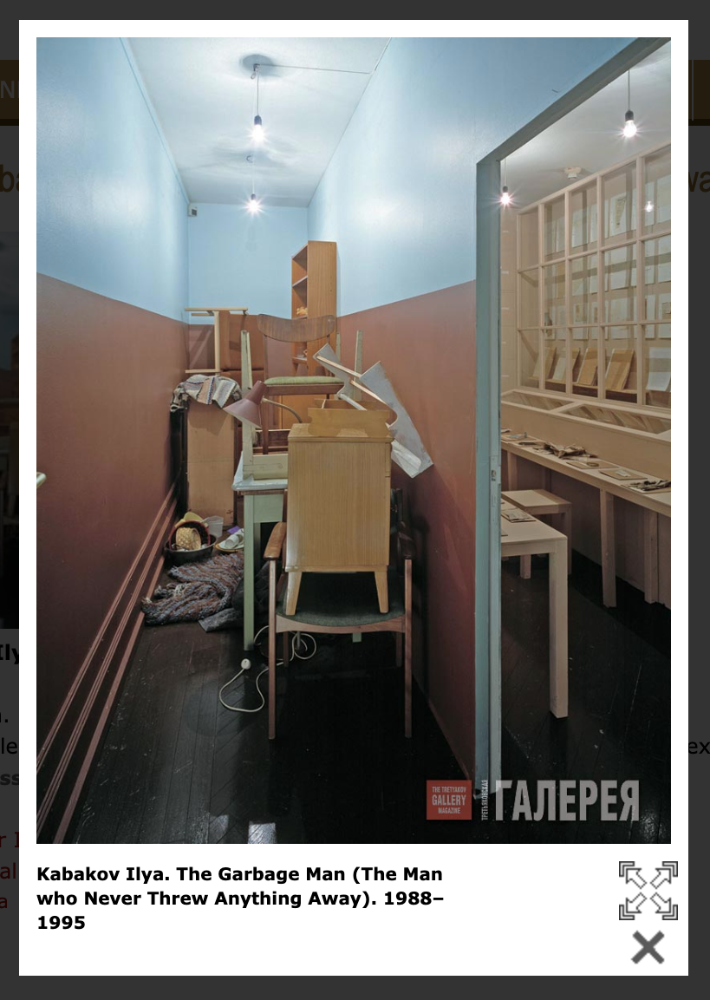

# First Artefact
<h3>Researching through the Archive with keywords</h3>
* personality 
* collector
* physcology
* mentality 
* character 
* individual
* society 
* loneliness
* solitude 
* interaction 
* autonomy
* independence 
* space 
* room
* surroundings
* environment
* box

| Tag | Data |  
|--|--|
**IISG Call Number** | [IISG BG X1/53](https://search.iisg.amsterdam/Record/1216448)
| **Collector** | Grootveld, Robert Jasper 
| **Period** | 1950-1974
| **Physical Description** | Textiel; 115x60 cm.
| **Genres** | Object, Textile
| **Type** | Visual Documents
| **Subject** | Biographica
| **Subject Location** | 	Netherlands
| **Note** | 	Gewaad waarop allerlei voorwerpen zijn bevestigd zoals bijv. een horloge (los), veer, pijp, doodskop etc.
|[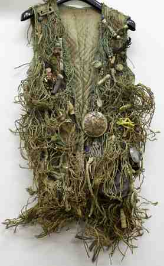](#)| This is literally a description of what you see in the image, make sure its a clear, complete and concise overview of the artefact. It should make sense for someone who doesn't see the image itself.  Our final *Catalogue of Resilience* might make use of one representative image from each student, so important to put your moneyshot here. You can build a gallery of additional artefact images below. 

# Research on Artefact
<h3>Jasper Robert Grootveld</h3>
 - Dutch Artist, 19 July 1932 – 26 February 2009 
 - Born in Amsterdam 
 - Had a specific philosophy regarding how the masses are brainwashed to become addicted consumers 
 - Robert Jasper Grootveld is one of the defining figures in post-war Dutch history 
 - A man from the street who therefore fell outside all existing frameworks, but with his unique performances he eventually broke them open one by one 
 - Around the age of eighteen he is deeply unhappy and he is admitted to a psychiatric hospital for observation 
 - In the fifties he maintains, looking for attention, a whole series of homosexual relationships with men who are not only a lot older than him, but who seem to have had a much better life, including a banker, a television reporter , a (hurried) priest, a poet, a harbor baron, a real estate trader and a (popular) writer 
 - Marijuana entered his life in the early 1960s. He also stops his homosexual contacts. It seems as if he is putting someone else in his place, who will not let him go for the rest of his life: Sinterklaas 
 - He attacks the cigarette industry that manipulates people through advertising and blinded the dangers of smoking. In the fall of 1961, he began to paint cigarette advertising posters with 'cancer' or with a k 
 - In 2007, his raft fleet is moored for the International Institute of Social History. RJG withdraws to a care home in Amsterdam 
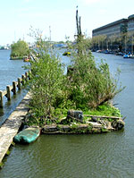
<h3>Amsterdam</h3>
- Magic Center Amsterdam grows in the late sixties and early seventies into one of the hippie capitals of the world
<h3>Provo Movement</h3>
<h3>Association De Dageraad</h3>
<h3>Events called Happenings in Amsterdam at Spui</h3>
<h3>Dutch subculture Nozems</h3>

# Final Trajectory of the Project
<h3>Book 'Solitude and privacy: a study of social isolation: its causes and therapy'</h3>
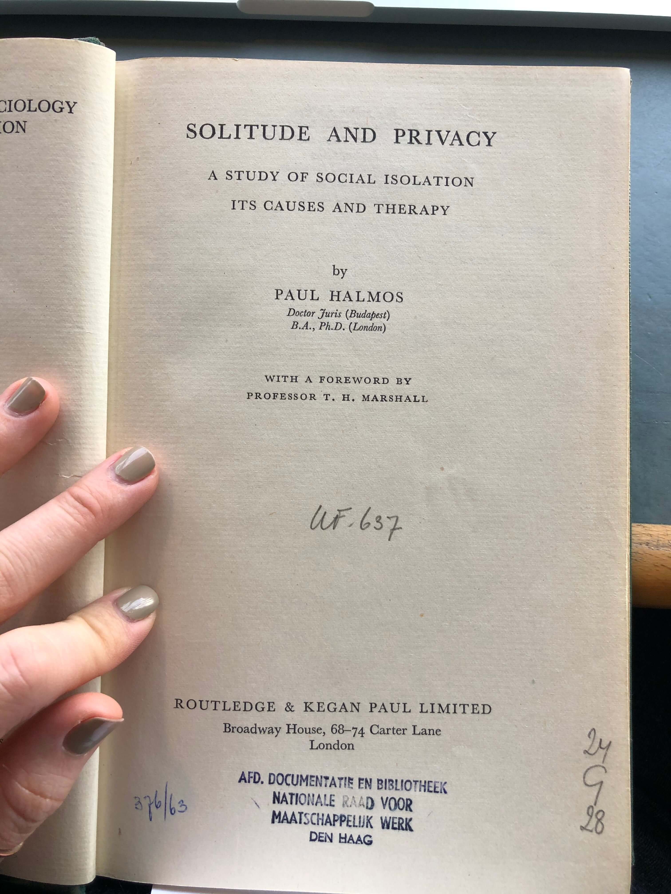
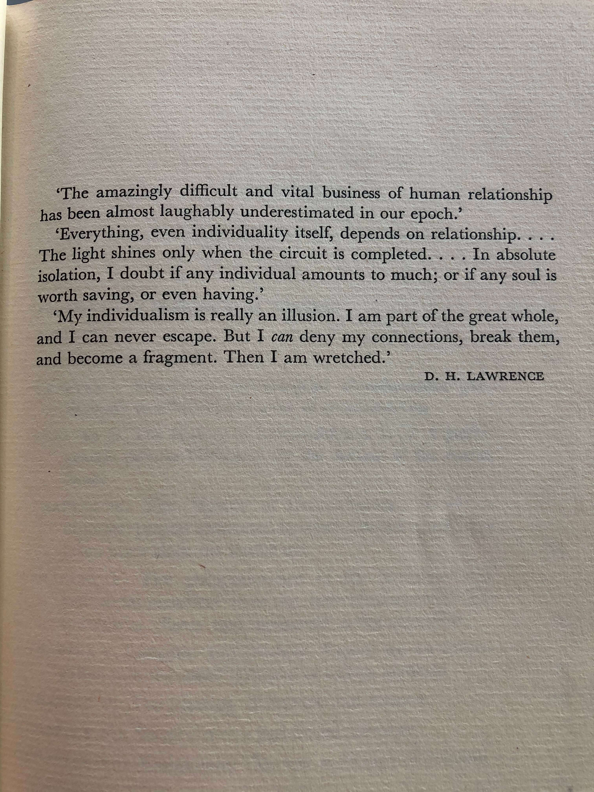

# Artefact
Serials 'Practical Self-Sufficiency': An Artefact that has an Aura

[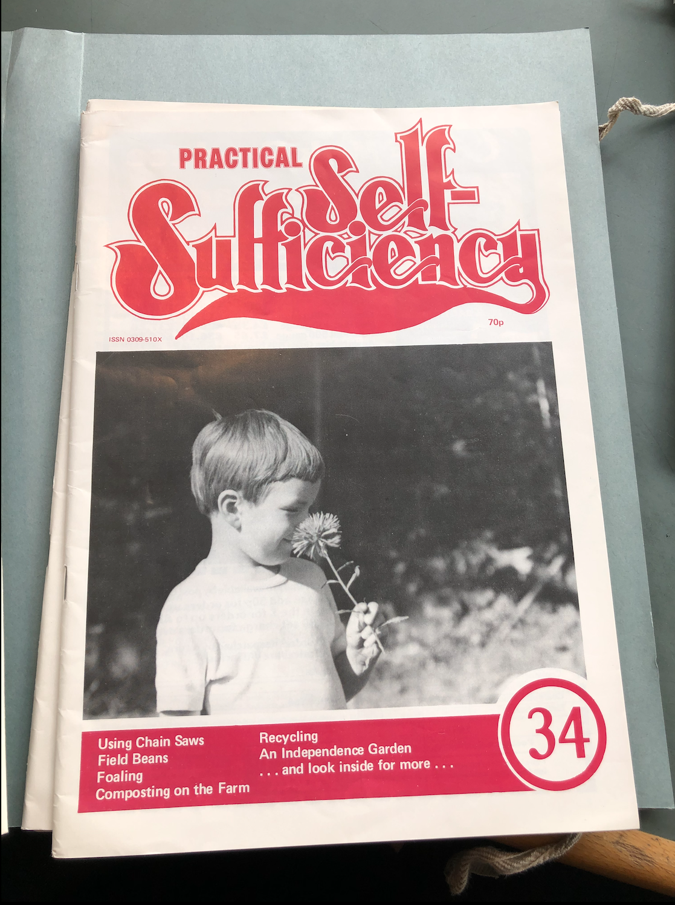](#)
[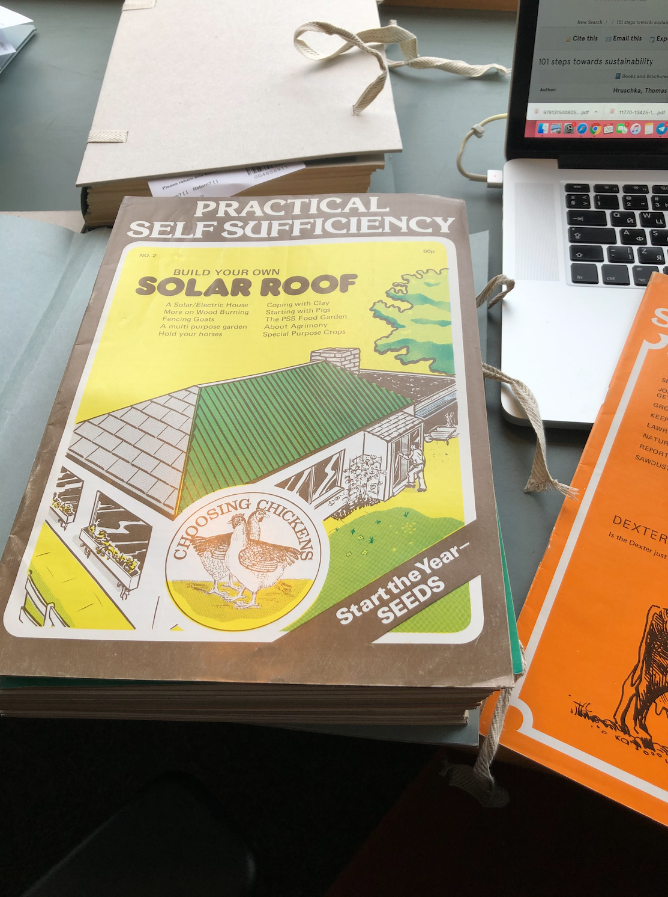](#)

## Metadata
| Tag | Data |  
|--|--|
**IISG Call Number** | [IISG ZK 54412](https://search.iisg.amsterdam/Record/1382152)
| **Physical Description** | Serials 
| **Type** | Object
| **Language** | English
| **Published** | 	Saffron Walden
|[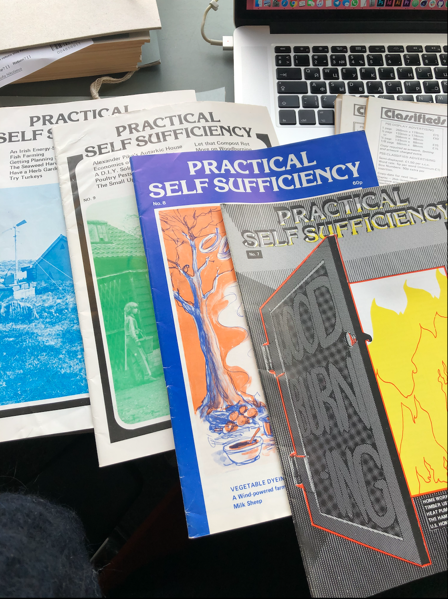](#)| This is literally a description of what you see in the image, make sure its a clear, complete and concise overview of the artefact. It should make sense for someone who doesn't see the image itself.  Our final *Catalogue of Resilience* might make use of one representative image from each student, so important to put your moneyshot here. You can build a gallery of additional artefact images below. 

 Entry points to the Artefact / What is to be decoded: 
 — global entry points: the topics of self-sufficiency / autonomy / independency / self- reliance and it's practical & mental aspects 
 — specific entry points: based on a particular article of a particular issue 

# Research on the Artefact
<h3>General Information</h3>
 - Editors: Katie Thear 
 - Graphics: Jim Hutchison 
 - Publisher: Broad Leys Publishing Company, Widdington, Saffron Walden, Essex 
 - Times when published: 1975-1985, 6 times a year 
 - Contributors: - 
 - Language: English 
 - Printed: Gamble&Wood, Station Road, Gt.Chesterford, Essex 
<h3>Topics inside an issue</h3>
 — how to sharpen workshop tools? 
 — how to grow your own watercress? 
 — how to keep warm with a wood stove? 
 — natural hair care 
 — seasonal guide 
 — caring for your own oil lamp 
 — making a hot bed 
 — is the Dexter just a rare breed or the ideal cow for the self supporter? 
 — building your own solar roof 
 — more on wood burning 
 — fencing goats 
 — a multi purpose garden 
 — hold your horses 
 — coping with clay 
 — starting with pigs 
 — about agrimony 
 — special purpose crops 
 — choosing chickens 
 — how much land for self-sufficiency? 
 — beginning with bees 
 — primitive leather working 
 — a vegan garden 
 — raising rabbits 
 — eucalyptus - the alternative tree 
 — feeding chuckens 
 — clay gardening 
 — soap from scratch 
 — using chain saws 
 — field beans 
 — composting on the farm 
 — recycling 
 — an independent garden 
 — a course in cooperative self reliance? 
<h3>Content types</h3>
 - table of contents 
 - coming soon 
 - notes from the publishers 
 - information, tips, practical suggestions contributed by readers 

# Global Research
<h3>Topics related to Self-Sufficiency</h3>
 — DIY 
 — Digital ecology 
 — Alternative education 
 — Holism 
 — Experimentalism 
 — Counterculture 
 — Radical Self-reliance 

<h3>Whole Earth Catalogue</h3>
 — self-sufficiency, ecology, alternative education, DIY, holism 
 — convention-challenging experimentalism 
 — counterculture 

<h3>CoEvolution Quarterly</h3>
 —  a journal which descended from Stewart Brand's Whole Earth Catalog 
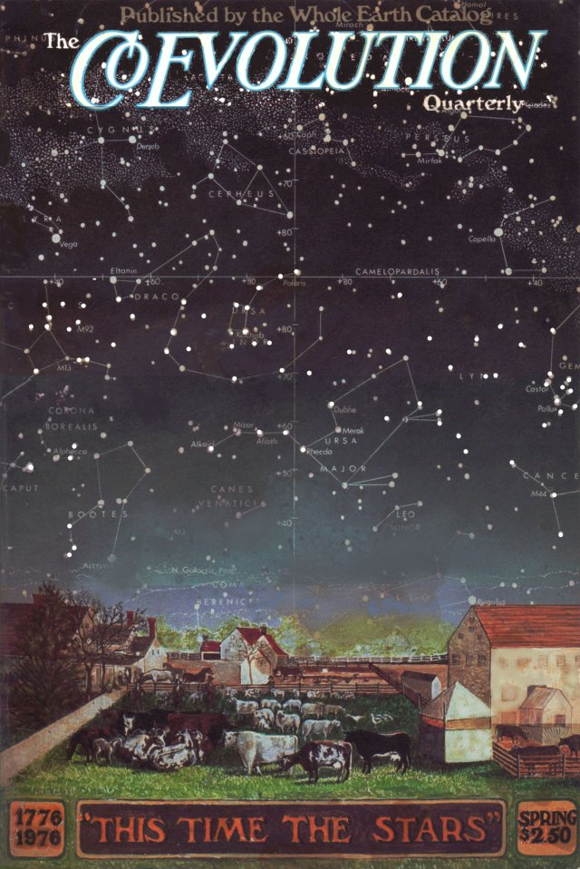
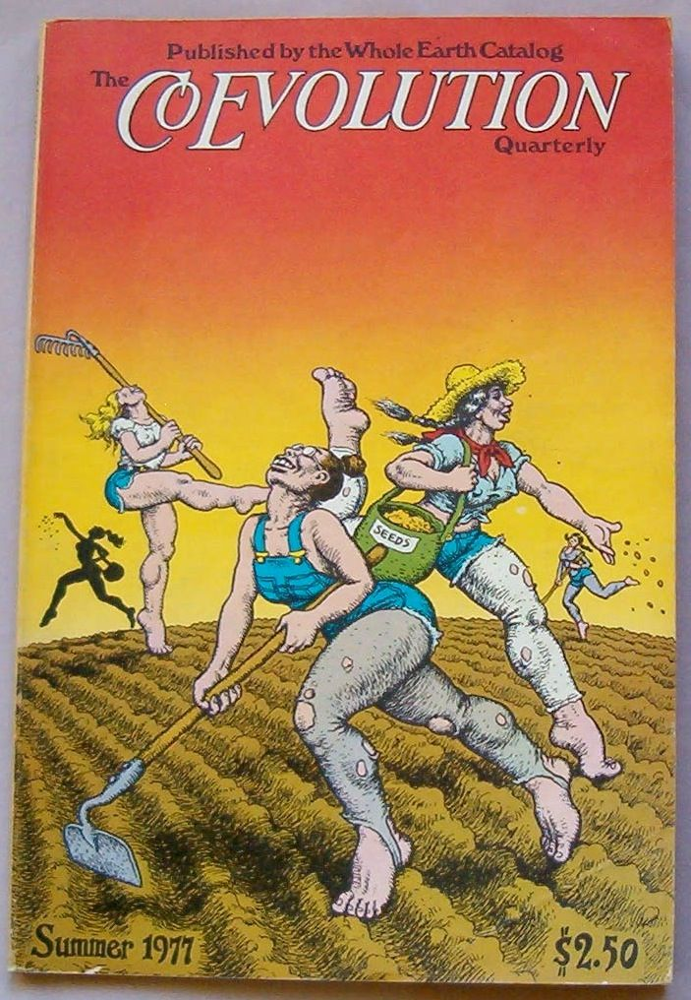
<h3>Online books pages by subject</h3>
 - https://onlinebooks.library.upenn.edu/subjects.html 

<h3>Cool Tools</h3>
 - https://kk.org/cooltools/ 
 — a website, which recommends the best/cheapest tools available 
 — anything that can be useful 
 — reviews written by real students 

<h3>Drop City</h3>
 — counterculture artists' community that formed in southern Colorado in 1965 
 —  the intention was to create a live-in work of Drop Art 
 — known as the first rural "hippie commune" 

<h3>Burning Man</h3>
 — described by participants as an experimental society, radical self-expression and radical self-sufficiency 
 — the idea is that during Burning Man, people will temporarily build a community 
 — participants are expected to be self-sufficient in their needs such as food, water and a place to sleep 
 — Burning Man is very dependent on the efforts of volunteers 

<h3>Freetown Christiania</h3>
 — is an intentional community and commune of about 850 to 1,000 residents, covering 7.7 hectares (19 acres) in the borough of Christianshavn in the Danish capital city of Copenhagen 

# Research Questions
 - Research Question #0: What defines a culture of online self-sufficiency? 
 -Research Question #1 (main):What strategies does the culture of online self-sufficiency use? 

# Transcodings
The main aim of each individual transcoding is to 'activate' the content inside of a chosen issue. The content is text and image based and has a tutorial / instruction like character. So with the individual transcodings I aim to give the content some dynamic with the format of an auido / video, but also to to make it some visual for people who will be diving into it.  

## Transcoding No. 1_Sketch
### Description
 The transcoding is based on the text from the publiser, found in issue No.1 dating November / December 1975. 
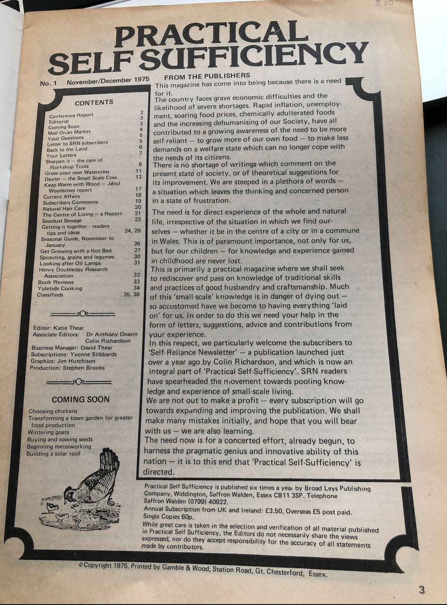
 The text is an entry point into the global topic of Self-Sufficient Living that the periodicals are adressing. More in detail, the text speculates about why there is a need for an individual to transfer to Self-Sufficient Living and encourages the reader to do so by bulding up a community via those printed issues. 

### Methods

 1. Audio 
 To listen to the reading: https://www.youtube.com/watch?v=p4yGQXLIQZM 
 However, since it is a relatively big text, purely audio format might not be the the best one to deliver the info to the listener to the full extend 
 2. Audio + Subtitles + Static Image 
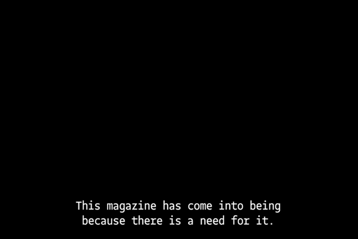
 3. Audio + Subtitles + Moving Image 
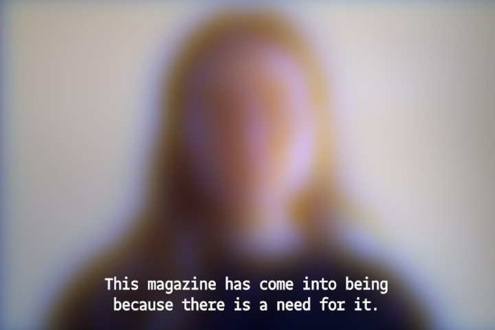
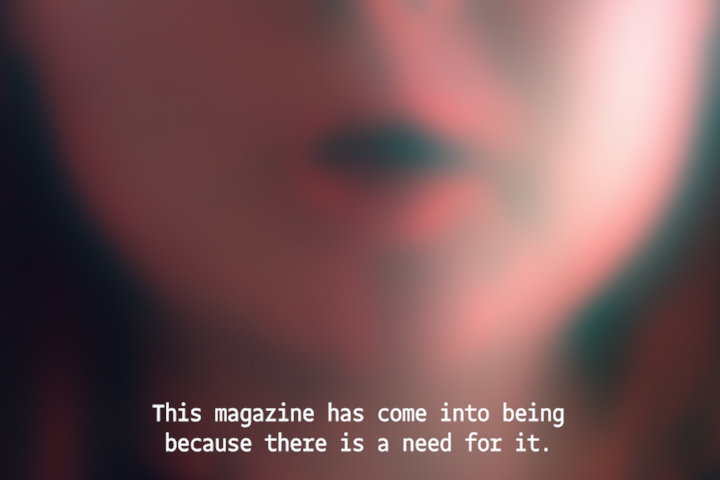

### Tools 
 1. TextEdit 
 2. Premiere Pro  
 2. Photoshop  

### Results
** will follow later **  

### Aims
<h3>1. Audio, video and still image formats:</h3>
 - the transcoding of individual entries from the inside of one of the issues of the periodicals 

### Methods
 1. Audio, video and still image formats 

### Results
** will follow later ** 

### Source Links
** will follow later **
 
# Reflection
** will follow later **

# Outcomes
 1. Multiple transcoding in a format of a still image / audio / video 
 2. A website collecting the transcoding together and contextualizing the topic of Self-Sufficient Living with references to the current times  

### Outcome Links
** will follow later **

## Bibliography
<a name="footnote-1">**[1]**</a>: Brows online books by subjects: e.g science, technology etc.
<a name="footnote-2">**[2]**</a>: A web site which recommends the best/cheapest tools available (https://kk.org/cooltools/)

## List of Feedbacks
<h3>From Martijn as of March 16th</h3>
 - digital realm, how can you be self-sufficient online, that means you don't use Google services, email and you need to set up your own? 
 - digital counterpart for the topics/articles in the issues 
 - the Whole Earth catalogue 
 - define a research question 
 - what are analogue strategies to transcode an artefact? 
 - what are the digital tools to transcode an artefact? 

<h3>From Hannes as of March 23rd</h3>
 - about the artefact: 1 way is transcoding the content of an artefact / 2 way is transcoding the context of an artefact 
 - about the transcoding: think of shapes for coming transcodings and quickly go for it, it can be rough 
 - about the transcoding: what is lost and what is gained during transcoding 
 - about the transcoding: what kind of things you'd like to make 
 - about readme. file: readme. file is one to present to the public, cleaned and refined one 
 - about readme. file: images can be either embedded links 
 - about readme. file: make a personal google drive, collect images there for notion 

<h3>From Martijn as of March 30th</h3>
 - create and maintain my own server 
 - how to make a self-sufficient video? 
 - open source community 
 - manifesto in 3 different mediums 
 - 3 different manifesto in 1 medium 
 - what elements define my existence online? e.g last time seen online, public IP address, internet provider, internet speed 
 - possible to set up own wifi network 

<h3>From Hannes as of April 8th</h3>
 - podcast to listen to (https://www.e-flux.com/podcasts/df2a7f44638448ac89e8c84f6ae322fe/extern) 
 - there should be 1 coding tool in the project 
 - subtitles are also a matter that can be designed 
 - be critical of a format, because it is already a relatively big text 
 - digital and practical self-sufficiency already co-exist online — > there is no need to invent (a sort of culture in my case) — > work with the 'raw' original text 
 - this original text of a publisher asks for a performative aspect 
 - this original text can be transcoded in 2/3 different mediums: 
    - make a reading, so audio medium 
    - make a video with visuals, so image medium 

 <h3>From Hannes and Martijn as of April 20th</h3>
 - there is already one concrete outcome — the collective [read.me](http://read.me) catalogue ('The Catalogue of Resillience') 
 - the approach to structure the catalogue is editorial 
 - week May 11-16 is when the [read.me](http://read.me) file should be final 
 - when defining the format of the transcoding, think as if it should actually replace the artefact in the IISG 
 - articles from the issue can be transcoded into video tutorials 
  - think of the following scheme: 1) pick one issue of the periodical — > 2) transcode the content into a digital publication aka the website — > 3) embed the links / references of how the community of self-sufficientcy functions now 
 - in a way, i have to be the contemporary designer of the old issue 
 - have a preliminary version of the website by May 4th 
