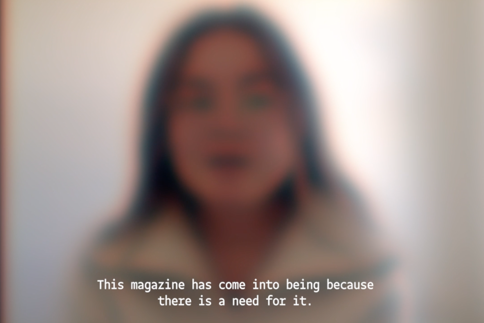

<h1>Self-Sufficient Living</h1>

### Table of Contents
1. [First Trajectory of the Project](#First-Trajectory-of-the-Project)
    1. [Starting Point](#Starting-Point)
    2. [First Artefact](#First-Artefact)
    3. [Research on Artefact](#Research-on-Artefact)
2. [Final Trajectory of the Project](#Final-Trajectory-of-the-Project)
3. [Artefact](#Artefact)
    1. [Metadata](#Metadata)
    2. [Research on the Artefact](#Research-on-Artefact)
4. [Global Research](#Global-Research)
5. [Research Questions](#Research-Questions)
6. [Transcodings](#Transcoding)
    1. [Transcoding No. 1](#Transcoding-no-1)
    2. [Transcoding Tool](#Transcoding-tool)
7. [Reflection](#Reflection)
8. [Outcome](#Outcome)
9. [Conclusion](#Conclusion)
10. [Bibliography](#Bibliography) 
11. [List of Feedbacks](#List-of-Feedbacks) 

# First Trajectory of the Project
<h3>The Initial Mindmap</h3>

obsessive collecting of objects in space / ordering and labelling of objects > it is a to compensate the mental emptiness and loneliness / solitude > also to isolate the Self and push the autonomy and independence of the Self, as it feels natural, it is a path > it is a patterned way of interaction with the surroundings, a particular strategy of an individual > on one side - independence and autonomy of Self in relation to the outer world & on another side - traces on loneliness / solitude are to be evident sooner or later 

<h3>Topic - Autonomous and / vs / yet Lonely Individual</h3>

# Starting Point
<h3>The starting point - Text "The Man who Never Threw Anything Away"</h3>

# First Artefact
<h3>Researching through the Archive with keywords</h3>
- personality
- collector
- physcology
- mentality 
- character 
- individual
- society 
- loneliness
- solitude 
- interaction 
- autonomy
- independence 
- space 
- room
- surroundings
- environment
- box

| Tag | Data |  
|--|--|
**IISG Call Number** | [IISG BG X1/53](https://search.iisg.amsterdam/Record/1216448)
| **Collector** | Grootveld, Robert Jasper 
| **Period** | 1950-1974
| **Physical Description** | Textiel; 115x60 cm.
| **Genres** | Object, Textile
| **Type** | Visual Documents
| **Subject** | Biographica
| **Subject Location** | 	Netherlands
| **Note** | 	Gewaad waarop allerlei voorwerpen zijn bevestigd zoals bijv. een horloge (los), veer, pijp, doodskop etc.
|| This is literally a description of what you see in the image, make sure its a clear, complete and concise overview of the artefact. It should make sense for someone who doesn't see the image itself.  Our final *Catalogue of Resilience* might make use of one representative image from each student, so important to put your moneyshot here. You can build a gallery of additional artefact images below. 

# Research on Artefact
<h3>Jasper Robert Grootveld</h3>
 - Dutch Artist, 19 July 1932 – 26 February 2009 
 - Born in Amsterdam 
 - Had a specific philosophy regarding how the masses are brainwashed to become addicted consumers 
 - Robert Jasper Grootveld is one of the defining figures in post-war Dutch history 
 - A man from the street who therefore fell outside all existing frameworks, but with his unique performances he eventually broke them open one by one 
 - Around the age of eighteen he is deeply unhappy and he is admitted to a psychiatric hospital for observation 
 - In the fifties he maintains, looking for attention, a whole series of homosexual relationships with men who are not only a lot older than him, but who seem to have had a much better life, including a banker, a television reporter , a (hurried) priest, a poet, a harbor baron, a real estate trader and a (popular) writer 
 - Marijuana entered his life in the early 1960s. He also stops his homosexual contacts. It seems as if he is putting someone else in his place, who will not let him go for the rest of his life: Sinterklaas 
 - He attacks the cigarette industry that manipulates people through advertising and blinded the dangers of smoking. In the fall of 1961, he began to paint cigarette advertising posters with 'cancer' or with a k 
 - In 2007, his raft fleet is moored for the International Institute of Social History. RJG withdraws to a care home in Amsterdam 

<h3>Amsterdam</h3>
- Magic Center Amsterdam grows in the late sixties and early seventies into one of the hippie capitals of the world
<h3>Provo Movement</h3>
<h3>Association De Dageraad</h3>
<h3>Events called Happenings in Amsterdam at Spui</h3>
<h3>Dutch subculture Nozems</h3>

# Final Trajectory of the Project
<h3>Book 'Solitude and privacy : a study of social isolation : its causes and therapy'</h3>

# Artefact
Serials 'Practical Self-Sufficiency': An Artefact that has an Aura

## Metadata
| Tag | Data |  
|--|--|
**IISG Call Number** | [IISG ZK 54412](https://search.iisg.amsterdam/Record/1382152)
| **Physical Description** | Serials 
| **Type** | Object
| **Language** | English
| **Published** | 	Saffron Walden
|| This is literally a description of what you see in the image, make sure its a clear, complete and concise overview of the artefact. It should make sense for someone who doesn't see the image itself.  Our final *Catalogue of Resilience* might make use of one representative image from each student, so important to put your moneyshot here. You can build a gallery of additional artefact images below. 

 Entry points to the Artefact / What is to be decoded: 
 — global entry points: the topics of self-sufficiency / autonomy / independency / self- reliance and it's practical & mental aspects 
 — specific entry points: based on a particular article of a particular issue 

# Research on the Artefact

# Global Research
<h3>Whole Earth Catalogue</h3>
 — self-sufficiency, ecology, alternative education, DIY, holism 
 — convention-challenging experimentalism 
 — counterculture 
<h3>CoEvolution Quarterly</h3>
 —  a journal which descended from Stewart Brand's Whole Earth Catalog 
[]
[]
<h3>Online books pages by subject</h3>
<h3>Cool Tools</h3>
<h3>Drop City</h3>
<h3>Burning Man</h3>
<h3>Freetown Christiania</h3>

# Research Questions

# Transcodings
Please include a general description of the role of transcoding in your project. Using the H2 headings below, you can specify individual Transcoding experiments. Think about your motivations in transcoding, and mention the role of tools (also those made during the assignment). This gives some direction to the reader about what they will read in more detail below. 

## Transcoding No. 1
### Description
Short description here. You can structure the information and documentation for each transcoding, design research or coding tool as you like. It's important that you make clear the aims & goals of the transcoding, what methods and tools you use. If this is often the same across different transcodings, consider making a standardised table at the beginning of each.

You should include well-formatted documentation of your experiments and developments below. Someone without previous knowledge about your work should be able to follow along the steps, aims and results of your developments from this structure. Make sure all media used is correctly linked or embedded (images, PDFs, Videos, etc). 

### Methods
Description of your methods, documentation of behind-the-scenes processes can go here. Think of the photos and videos you made when visiting the IISG or during captures of your artefact. You can use tools such as [Gifs.com](https://gifs.com/) to generate moving-image thumbnail to link to short videos.Just enough to give a clear overview, before getting into details.  

With some HTML tags you can do simple styling in markdown, for example:

    <width="50%">

Remember to include the url link to jump to the full media, of course! 

### Tools 
Mention the tools that you used or made (if and when relevant). 

### Results
Some of your transcoding experiments may have smaller outcome sketches like images or short video tests. They can go directly within this section. Or maybe this transcoding became a part of the final outcome format. When that is the case, you can simply include a [hyperlink](#) to the final outcomes in the **Transcoding** section. In the final outcome section below you can embed or explain the final format outcome in detail.  

## Transcoding Tool 
### Description
You might have made multiple coding tools during the semester. Or the transcoding tool might be part of a specific transcoding experiment itself. It's up to you to define the linear flow of the Readme. Just like the transcoding of media itself, the coding tool should be well documented. So if you are using a coding tool in your first experiment, include the documentation of the coding tool **before** you include the results, etc. 

### Aims
Include the main aims or intentions behind making the tool, and what it is used for. 

### Methods
This includes the coding languages, coding frameworks or libraries, and any platforms or webtools for example.   

### Results
The coding tool will vary a lot between different students. So depending on the use and type, you may include more or less documentation here. 

### Source Links
Please include links to the tools, sources etc used during the coding. E.g. the resources used for making your coding tool.  
 

# Reflection
You might want to include a section about reflecting on the results of your coding and IMD experiments this semester. It can give additional context before reading the final outcomes below. 

# Outcomes
This section will be different for each student, depending on how and what is formatted as a final result for the semester assignment. Nevertheless a clear written and documented outcomes is important. So give the appropriate subsections or formats to make this as thorough as possible. 

### Outcome Links
Here you link to your final assignment outcomes. This could be a website, a video, etc etc. Please include links to the appropriate GitHub folder on your repository where your coding tool is stored. 

This is the main way to access your IMD + Coding outcomes for the semester. So its very important that you check for bugs, troubleshoot hyperlink issues, embedded media issues etc. Please make sure you KNOW where each file you use is stored. E.g. If you migrated from Notion markdown into GitHub, its **VERY IMPORTANT** to know that Notion randomly stores images on an Amazon server. It changes those locations all the time. So if your main outcome or documentation is still grabbing those links, **its very likely** they might disappear before collectives. So please have all media and necessary files managed well in your own locations (online or github etc).   

# Conclusion 
You might have a nice conclusive observation to share at the end :) 

## Bibliography
Of course, as with all research work please include a good bibliography with links, and any references that were used or might give additional depth to the work. 

<a name="footnote-1">**[1]**</a>: Look at this little referenced footnote over here. You can look up different text formats for referencing books, online articles, films etc. 

## List of Feedbacks

